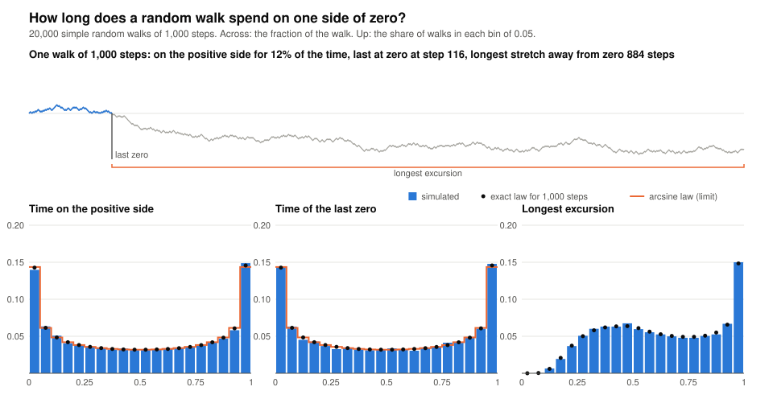

# The arcsine law: how long a random walk spends on one side of zero

Flip a fair coin a thousand times, stepping up on heads and down on tails,
and keep track of how much of the time the walk is above where it started.
Intuition says about half. It isn't. A walk is far more likely to spend
nearly all of its time on one side than to split its time evenly: the
fraction follows the arcsine law, whose density 1 / (π √(x(1−x))) is lowest
in the middle and climbs without bound at the two ends. This project
simulates 20,000 walks, measures three things about each, and puts the
histograms beside the exact laws.

<p align="center">
  <a href="out/arcsine.svg"></a>
</p>

## Run

```sh
python projects/arcsine/arcsine.py                                         # 20,000 walks of 1,000 steps; summary as text
python projects/arcsine/arcsine.py --out projects/arcsine/out/arcsine.svg  # and write the chart
python projects/arcsine/arcsine.py --steps 200 --exact-longest             # exact longest-excursion numbers (cubic time)
pytest projects/arcsine
```

## How it works

- A walk of m steps is one `getrandbits(m)` call turned into ±1 steps and
  run through `itertools.accumulate`. Twenty thousand walks of a thousand
  steps take about two seconds.
- Three measurements per walk. The **time on the positive side** counts, in
  Feller's sense, the unit intervals during which the path is above the
  axis: the interval from k−1 to k counts if S(k−1) > 0 or S(k) > 0, so a
  walk that touches zero and goes straight back up never leaves the positive
  side, and the count is always even. The **last zero** is the last time the
  walk is at 0. The **longest excursion** is the longest stretch between
  visits to zero, counting the unfinished stretch after the last one.
- The exact law is Feller's (*An Introduction to Probability Theory and Its
  Applications*, volume 1, chapter III): for a walk of 2n steps, the time on
  the positive side is 2k with probability u(k)·u(n−k), where
  u(k) = C(2k, k) / 4^k is the probability of being back at zero after 2k
  steps, and the last zero is at time 2k with the same probability. As n
  grows both tend to the arcsine law, P(fraction ≤ x) = (2/π) arcsin √x. A
  test enumerates every walk of up to ten steps and checks both counts
  against the formula exactly, in fractions.
- The longest excursion has no formula I know of, so its exact distribution
  comes from a renewal recursion. Let g(t) be the probability of being at
  zero at time 2t with every completed excursion at most 2ℓ long; then
  g(t) = Σ f(j) g(t−j) over the first-return probabilities
  f(j) = u(j−1) − u(j) with j ≤ ℓ, and the longest excursion is at most 2ℓ
  with probability Σ g(t)·u(n−t) over the t whose unfinished final stretch
  of 2(n−t) steps is also short enough. The same recursion gives the chance
  that the final stretch is the longest one, and the exact mean of the
  longest excursion. All three are checked against the enumeration of every
  short walk; the last two are cubic in the number of steps, so they're for
  walks of a few hundred steps.
- The chart is hand-written SVG: one sample walk, then three histograms with
  the exact law as dots and the arcsine law as an orange staircase. The
  staircase is the probability the limit law gives each bin, not its
  density, so the end bins compare honestly with the bars. A test
  regenerates the chart and checks that the committed file matches.

## What I found

**The middle is the least likely place.** Of 20,000 walks of 1,000 steps,
41.2% spent at least nine tenths of the time on one side (the exact law says
41.3%, the limit 41.0%), and only 13.1% split their time anywhere between
40/60 and 60/40 (exact 12.9%). The mean fraction is one half, 0.5003
measured, and almost nothing is near it.

**Two quantities, one law.** The time of the last zero has the same
distribution as the time on the positive side, atom for atom, and the
simulation agrees with the law for both: Kolmogorov distances of 0.005 and
0.006 over 20,000 walks, against a typical 0.007 for that many samples.

**At a thousand steps the limit has arrived.** The exact law and the arcsine
law differ by less than 0.001 in every bin but the top one. That bin is
closed at 1 where the others are half-open, so it holds one more atom of the
discrete law than the bottom bin does; the 0.002 gap there is the binning,
not the law.

**The longest excursion is not arcsine.** Its distribution is a broad hump
around four tenths of the walk with a spike at the top, and the recursion's
dots sit on the simulated bars. Its mean is 0.626 of the walk's length at
1,000 steps, and the unfinished stretch after the last zero is the longest
one in 62.3% of walks. Those two numbers are within noise of each other, and
I nearly wrote them down as one fact. The exact recursion on shorter walks
says otherwise: the mean is still falling with the walk's length (0.651 at
20 steps, 0.637 at 50, 0.632 at 100, 0.629 at 200), while the probability
that the final stretch is the longest is 0.6264 at 50 steps and 0.6265 at
100 and at 200, and does not move. They happen to cross near a thousand steps. The probability
looks like a constant of the walk, and I don't know a closed form for it;
both are in the backlog as curiosities.

**The sample walk.** The first walk the seed produces is on the positive
side for 12% of its time, is last at zero at step 116, and then stays below
zero for 884 steps. By the law, that's an ordinary walk.

## Files

- `arcsine.py`: the walk, the three measurements, Feller's law, the renewal
  recursion, the binning, the chart, and a small CLI.
- `test_arcsine.py`: the measurements on hand-made walks; every law against
  the enumeration of all walks up to ten steps; the simulation against the
  laws; the binning; the chart's contents; the CLI; and that the committed
  chart matches the code.
- `out/arcsine.svg`: the chart, 27 KB.
