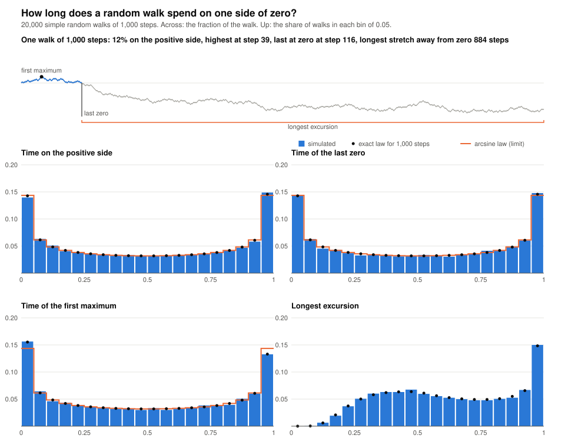

# The arcsine law: how long a random walk spends on one side of zero

Flip a fair coin a thousand times, stepping up on heads and down on tails,
and keep track of how much of the time the walk is above where it started.
Intuition says about half. It isn't. A walk is far more likely to spend
nearly all of its time on one side than to split its time evenly: the
fraction follows the arcsine law, whose density 1 / (π √(x(1−x))) is lowest
in the middle and climbs without bound at the two ends. This project
simulates 20,000 walks, measures four things about each, and puts the
histograms beside the exact laws.

<p align="center">
  <a href="out/arcsine.svg"></a>
</p>

## Run

```sh
python projects/arcsine/arcsine.py                                         # 20,000 walks of 1,000 steps; summary as text
python projects/arcsine/arcsine.py --out projects/arcsine/out/arcsine.svg  # and write the chart
python projects/arcsine/arcsine.py --exact-longest                         # the longest excursion's exact mean, and the final-stretch probability, at every round length up to 1,000 steps
python projects/arcsine/arcsine.py --exact-longest --steps 4000            # the same up to 4,000 steps, about ten seconds
pytest projects/arcsine
```

## How it works

- A walk of m steps is one `getrandbits(m)` call turned into ±1 steps and
  run through `itertools.accumulate`. Twenty thousand walks of a thousand
  steps take about two seconds.
- Four measurements per walk. The **time on the positive side** counts, in
  Feller's sense, the unit intervals during which the path is above the
  axis: the interval from k−1 to k counts if S(k−1) > 0 or S(k) > 0, so a
  walk that touches zero and goes straight back up never leaves the positive
  side, and the count is always even. The **last zero** is the last time the
  walk is at 0. The **first maximum** is the first time the walk is at its
  highest point (0 if it never rises above its start). The **longest
  excursion** is the longest stretch between visits to zero, counting the
  unfinished stretch after the last one.
- The exact laws are Feller's (*An Introduction to Probability Theory and
  Its Applications*, volume 1, chapter III): for a walk of 2n steps, the
  time on the positive side is 2k with probability u(k)·u(n−k), where
  u(k) = C(2k, k) / 4^k is the probability of being back at zero after 2k
  steps, and the last zero is at time 2k with the same probability. The
  first maximum is at time 0 with probability u(n) and at time k ≥ 1 with
  probability u(j)·u(n−j) / 2, where j = ⌊k/2⌋: the k steps before it, read
  backwards, are a walk that stays strictly positive, and the steps after it
  are a walk that stays at or below zero. Times 2j and 2j+1 together carry
  the arcsine atom u(j)·u(n−j), so all three tend to the same limit,
  P(fraction ≤ x) = (2/π) arcsin √x, but the ends differ: the atom at 0 is
  whole and time 1 carries another half of it, while the atom at 2n is
  halved, which pays for that since the two end atoms are equal. That's
  the tie-break. A walk that never rises above zero has its
  first maximum at time 0 whatever it does afterwards, while a maximum at
  the last step has to be a strict one. The last maximum has the mirror
  image of this law. A test enumerates every walk of up to ten steps and
  checks all three counts against the formulas exactly, in fractions.
- The longest excursion has no formula I know of, so its exact distribution
  comes from a renewal recursion. Let g(t) be the probability of being at
  zero at time 2t with every completed excursion at most 2ℓ long; then
  g(t) = Σ f(j) g(t−j) over the first-return probabilities
  f(j) = u(j−1) − u(j) with j ≤ ℓ, and the longest excursion is at most 2ℓ
  with probability Σ g(t)·u(n−t) over the t whose unfinished final stretch
  of 2(n−t) steps is also short enough. Two shortcuts keep it quick: up to
  t = ℓ nothing can be too long, so g(t) = u(t), and up to t = 2ℓ at most
  one excursion can, so g(t) = 2u(t) − u(ℓ), because a bridge of 2t steps
  holds an excursion of length 2j with probability f(j) whatever happens
  around it and the too-long ones telescope to u(ℓ) − u(t). After that the
  recursion runs as a dot product in C.
- The chance that the **final stretch is the longest** is
  Σ g(t)·u(n−t) with ℓ = n−t, so the rows for every ℓ serve every walk
  length at once, and one pass gives the probability at every even length
  up to the one asked for. The **mean longest excursion** comes from those
  for free, by an identity that holds walk by walk: two more steps lengthen
  the longest excursion by exactly two when the final stretch was already
  at least as long as every completed excursion, and by nothing otherwise
  (whether or not the walk is back at zero at the new end, the new longest
  is the larger of the longest completed excursion and the old final stretch
  plus two). So the mean grows by twice the probability at each length, and
  the means are running sums. Both were cubic-time recursions that stopped
  at a few hundred steps; the whole table is still cubic in principle, about
  (n/2)³/54 multiplications for n steps, but 1,000 steps now take a fifth
  of a second and 4,000 about ten. Everything is checked against the
  enumeration of every short walk, and the identity is checked on every
  walk of up to ten steps and every way of extending it.
- The chart is hand-written SVG: one sample walk, then four histograms with
  the exact law as dots and the arcsine law as an orange staircase. The
  staircase is the probability the limit law gives each bin, not its
  density, so the end bins compare honestly with the bars. A test
  regenerates the chart and checks that the committed file matches.

## What I found

**The middle is the least likely place.** Of 20,000 walks of 1,000 steps,
41.2% spent at least nine tenths of the time on one side (the exact law says
41.3%, the limit 41.0%), and only 13.1% split their time anywhere between
40/60 and 60/40 (exact 12.9%). The mean fraction is one half, 0.5003
measured, and almost nothing is near it.

**Three quantities, one law.** The time of the last zero has the same
distribution as the time on the positive side, atom for atom, and the time
of the first maximum has it up to the tie-break at the ends. The simulation
agrees with all three: Kolmogorov distances of 0.005, 0.006 and 0.004 over
20,000 walks, against a typical 0.007 for that many samples.

**At a thousand steps the limit has arrived.** The exact law and the arcsine
law differ by less than 0.001 in every bin but the top one. That bin is
closed at 1 where the others are half-open, so it holds one more atom of the
discrete law than the bottom bin does; the 0.002 gap there is the binning,
not the law.

**The maximum leans early, and the lean is exactly the tie-break.** A walk
of 1,000 steps never rises above its start with probability u(500) = 0.025,
and then its first maximum is at time 0. The chart shows the consequence:
the first bin holds 0.155 of the walks (0.156 simulated) where the arcsine
law gives 0.144, and the last bin 0.133 (0.133 simulated). The maximum
comes in the first tenth of the walk for 21.8% of walks and in the last
tenth for 19.4% (22.2% and 19.3% simulated), and its mean time is
(n + ½)(1 − u(n)) rather than n: 0.488 of the walk (0.487 simulated). In
the limit the atom at 0 vanishes and the lean with it, which is why Feller
can call this the third arcsine law; at a thousand steps it is still
plainly there in the picture.

**The longest excursion is not arcsine.** Its distribution is a broad hump
around four tenths of the walk with a spike at the top, and the recursion's
dots sit on the simulated bars. Its mean is 0.626 of the walk's length at
1,000 steps, and the unfinished stretch after the last zero is the longest
one in 62.3% of walks. The first pass found those two numbers within noise
of each other, computed both exactly, and concluded they were a
coincidence: the exact mean was still falling with the walk's length while
the probability had settled at 0.6265. Both facts were right and the
conclusion was wrong. The identity above says the mean is the running
average of the probability over all the shorter lengths, so the two have
the same limit, and the mean lags because the probability was higher for
very short walks (it is 1 for a walk of no steps and ½ for two). What
`--exact-longest --steps 4000` prints:

```
steps   mean fraction   final stretch is longest   (mean - final) x steps
   10        0.676562                   0.625000                    0.5156
   20        0.651480                   0.627129                    0.4870
   50        0.636510                   0.626384                    0.5063
  100        0.631507                   0.626539                    0.4969
  200        0.629008                   0.626515                    0.4984
  500        0.627508                   0.626509                    0.4994
 1000        0.627008                   0.626508                    0.4997
 2000        0.626758                   0.626508                    0.4998
 4000        0.626633                   0.626508                    0.4999
```

So the probability reads 0.626508 at 1,000 steps and beyond, the mean
longest excursion is that fraction of the walk plus what looks like exactly
half a step, and the first pass's "0.0005 apart at 1,000 steps" was
½ / 1,000. The probability wobbles on its way in: it is exactly 5/8 for
walks of 4, 6, 10 and 14 steps and not for 8, 12 or 16, and the wobble,
about 0.3 / steps² with the sign alternating between neighbouring lengths,
keeps lengths that are 2 mod 4 at 0.626507 until about 1,800 steps. The
limit is about 0.6265076. I don't have a closed form for 0.626508. As I remember the
literature, it is the expected length of the longest excursion of Brownian
motion on a unit interval, meander included (Pitman and Yor's
Poisson–Dirichlet partition with parameters ½ and 0; Godrèche, Majumdar
and Schehr's constant for the longest excursion), and the identity is the
discrete form of a simple fact about Brownian motion: the longest excursion
grows at rate one exactly while the current unfinished stretch is the
longest, so its expected length at time t is t times the probability that
the unfinished stretch is the longest, and by scaling that probability is
the same at every t. I couldn't check the references from here.

**The sample walk.** The first walk the seed produces is on the positive
side for 12% of its time, is first at its maximum at step 39, is last at
zero at step 116, and then stays below zero for 884 steps. By the law,
that's an ordinary walk.

## Files

- `arcsine.py`: the walk, the four measurements, Feller's laws, the renewal
  recursion and the identity that makes the mean a running sum, the
  binning, the chart, and a small CLI.
- `test_arcsine.py`: the measurements on hand-made walks; every law against
  the enumeration of all walks up to ten steps; the identity on every walk
  of up to ten steps and every extension of it; the recursion at 1,000
  steps against the numbers above; the simulation against the laws; the
  binning; the chart's contents; the CLI; and that the committed chart
  matches the code.
- `out/arcsine.svg`: the chart, 32 KB.
