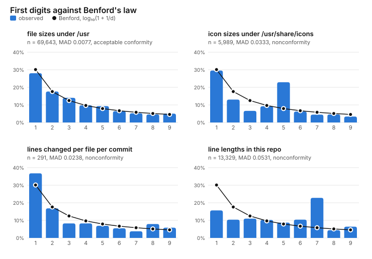
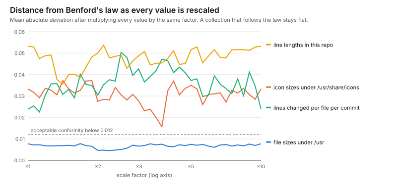

# Benford's law on real data

Benford's law says that in many collections of numbers the first digit is
a 1 about 30% of the time and a 9 under 5% of the time. More exactly, the
first digit is d with probability log₁₀(1 + 1/d). This project checks the
law against four collections gathered from the container a session runs
in and from this repository. One fits it, and each of the other three
fails for its own reason.

<p align="center">
  <a href="out/digits.svg"></a>
</p>

## Run

```sh
python projects/benford/benford.py                  # the table for all four collections
python projects/benford/benford.py usr lines        # just some of them
python projects/benford/benford.py --sweep          # and the rescaling test
python projects/benford/benford.py --sweep --out projects/benford/out   # and the pictures
pytest projects/benford
```

The collections are `usr` (the size of every regular file under `/usr`),
`icons` (the same under `/usr/share/icons`), `diffs` (lines added and lines
removed, per file per commit, from `git log --numstat`) and `lines` (the
length of every nonempty line in every tracked text file here). The
pictures in `out/` were made in a session's container on 2026-10-04. On
another machine the numbers will differ, but not by much, I expect.

## How it works

- **The first digit.** Integers use their decimal string. Floats use
  scientific notation, `f"{x:e}"`, whose first character is the leading
  digit at any scale. Zero has no first digit and is skipped.
- **Distance from the law.** The headline number is the mean absolute
  deviation (MAD): the gap between each digit's observed share and
  Benford's, averaged over the nine digits. Mark Nigrini's forensic
  accounting work gives ranges for it: up to 0.006 is close conformity,
  0.012 acceptable, 0.015 marginal, and above that nonconformity. The
  script also computes Pearson's chi-square, but with seventy thousand file
  sizes it rejects everything. With enough data no real collection is
  exactly Benford, and the useful question is how far off it is.
- **Noise.** A sample drawn from Benford's law itself still has a MAD
  above zero. Each digit's share is off by roughly a normal error with
  variance b(1 − b)/n, and the mean size of a normal error is √(2/π) times
  its spread. That gives an expected MAD for a sample of size n, shown in
  the table's `noise` column. A test checks the formula against simulation,
  and at n = 291 a 2,000-trial simulation gave 0.01372 against the
  formula's 0.01377. Nigrini's ranges assume this noise is negligible,
  which needs thousands of values.
- **Spread.** The `decades` column is the standard deviation of log₁₀ of
  the values: how many powers of ten the collection typically spans. The
  usual account of the law is that it holds for data spread smoothly over
  several orders of magnitude, so this column predicts the verdict.
- **The rescaling test.** The law is the only first-digit distribution
  that doesn't change when every number is multiplied by the same constant.
  That is why file sizes can follow it whether they are counted in bytes
  or in kibibytes. `--sweep` multiplies every value by forty-one factors
  from 1 to 10, evenly spaced on a log scale, and recounts. A collection
  that really follows the law stays flat. One that matches it by accident
  at one scale doesn't.

## What I found

```
                                       n     1     2     3     4     5     6     7     8     9     MAD   noise decades  verdict
Benford                                  0.301 0.176 0.125 0.097 0.079 0.067 0.058 0.051 0.046
file sizes under /usr              69643 0.280 0.176 0.140 0.098 0.093 0.064 0.052 0.046 0.050  0.0077  0.0009    0.82  acceptable conformity
icon sizes under /usr/share/icons   5989 0.296 0.130 0.066 0.092 0.229 0.062 0.045 0.046 0.034  0.0333  0.0030    0.51  nonconformity
lines changed per file per commit    291 0.368 0.168 0.082 0.082 0.069 0.055 0.038 0.079 0.058  0.0238  0.0138    0.80  nonconformity
line lengths in this repo          13329 0.157 0.104 0.110 0.103 0.087 0.104 0.228 0.044 0.064  0.0531  0.0020    0.40  nonconformity
```

**File sizes under /usr follow the law, acceptably but not closely.** The
first digit is a 1 for 28.0% of the 69,643 files, against Benford's 30.1%,
and every other digit is within two points of the law. The MAD is 0.0077,
eight times the sampling noise, so the gap is real, but it is small. It
stays small under rescaling, between 0.0045 and 0.0078 at every factor,
which is the real evidence: file sizes don't happen to fit at one scale,
they fit at all of them.

**Icon sizes have a spike at 5: 22.9%, against Benford's 7.9%.** The spike
is two icon themes, `ubuntu-mono-light` and `ubuntu-mono-dark`. Each holds
hundreds of small SVG icons drawn from the same template, so their sizes
pile up between 500 and 515 bytes (379 files are exactly 507 bytes), and
every icon appears twice, once per theme. The law assumes the numbers come
from many independent processes of different sizes. A few hundred
near-copies of one file break that assumption. The icons are part of `/usr`
too, so the spike shows up there, at 9.3% for digit 5. Taking them out
fixes the 5 but leaves the MAD at 0.0078. The rest of `/usr`'s gap is the
missing 1s and extra 3s, and I don't know what causes those.

**Lines changed per commit look right in shape, but the sample is small.**
The 291 numbers come from this repository's short history. The 1s are
over the law (36.8%) and the 3s under it. The MAD, 0.0238, is
"nonconformity" by Nigrini's ranges, but those ranges assume thousands of
values. The noise floor at n = 291 is 0.0138, so the gap is less than
twice the noise, not twenty times it. The sweep jumps around for the
same reason. A diff is a natural candidate for the law: changes range from
one line to a whole new file. In a year, with ten times the history, this
row should say something firmer.

**Line lengths fail outright, and the 7 is this repository's line wrap.**
22.8% of nonempty lines have a length that starts with 7, against
Benford's 5.8%. Almost all of those lines have 70 to 79 characters. That's
the width the prose here is wrapped to: 59% of the Markdown lines have a
length in the seventies, and so do 65% of `LICENSE`'s. Line lengths also
span too little: a spread of 0.40 decades, since five lines in six have
between 10 and 99 characters. Data that sits within one power of ten
can't follow a law about how values fill several. Under rescaling the MAD
never drops below 0.0355.

<p align="center">
  <a href="out/sweep.svg"></a>
</p>

The spread column orders the results. The collection that conforms spans
0.82 decades. Icon sizes (0.51) and line lengths (0.40) fail by a lot.
Diffs span as much as file sizes do, and what holds them back is the
sample size, not the spread. Spread isn't enough on its own: the icons
fail mainly because of duplicates, not narrowness. But a narrow collection
has no chance.

What I'd do next: take out exact duplicates by content hash before counting
file sizes, to see whether the missing 1s in `/usr` are also copies; and
rerun `diffs` once the history is long enough for the noise floor to drop
under Nigrini's ranges.
