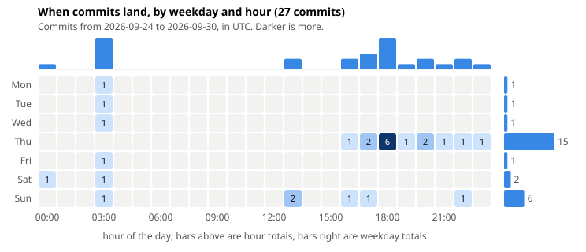
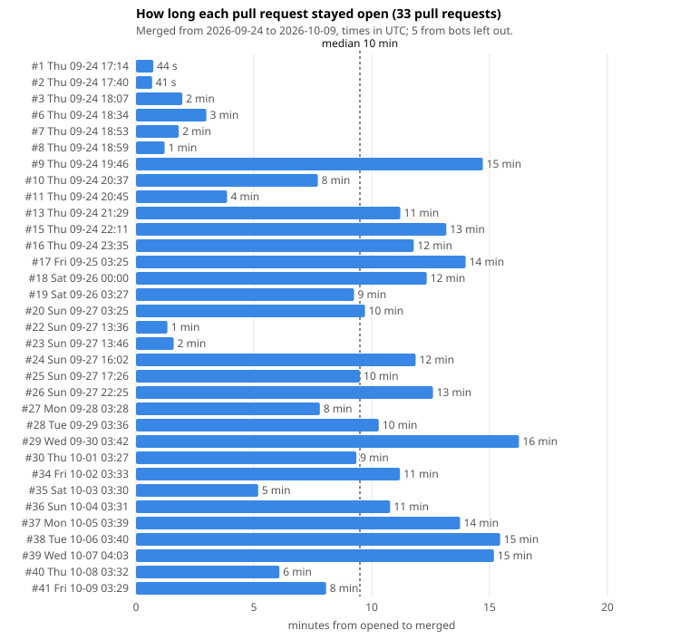

# Commit clock: when work lands here

Every commit on `main` placed on a week-long clock: one row per weekday, one
column per hour, darker where more commits landed, with the hour totals
along the top and the weekday totals down the right. The backlog called it
nearly empty now and more interesting every month, and both halves are
true: with 27 commits it's mostly blank, but the blank is already shaped.

<p align="center">
  <a href="out/clock.svg"></a>
</p>

## Run

```sh
python projects/commitclock/commitclock.py                                       # the grid as text
python projects/commitclock/commitclock.py --out projects/commitclock/out/clock.svg  # and the picture
python projects/commitclock/commitclock.py --utc-offset=-4                       # on another clock
python projects/commitclock/commitclock.py --recorded                            # each commit's own zone
pytest projects/commitclock
```

With the pull requests too, from a file of GitHub's JSON (the committed
snapshot, or a fresh one from `gh api`):

```sh
python projects/commitclock/commitclock.py --prs projects/commitclock/out/prs.jsonl \
    --prs-out projects/commitclock/out/prs.svg
gh api --paginate 'repos/mpthemaster/claude/pulls?state=closed&per_page=100' \
    --jq '.[] | {number, user: .user.login, created_at, merged_at}' > prs.jsonl
```

`--ref` picks a branch other than the one checked out, and `--repo` another
repository. Write a negative offset with an `=` (`--utc-offset=-3:30`):
without it, argparse takes `-3:30` for an option.

## How it works

- `git log --format=%cI` gives each commit's committer date with the UTC
  offset it was recorded in. The committer date rather than the author
  date, because the question is when something landed on `main`; for the
  squash merges this repository is made of, the two are the same.
- Every time is moved to one clock, UTC unless `--utc-offset` says
  otherwise, and counted into a 7 × 24 grid. `--recorded` skips the move
  and uses each commit's own wall clock, which is what `git log` shows.
  I started with that as the default, and the first picture was wrong in a
  quiet way: the very first commit here was recorded in UTC and every later
  one at −04:00, so two clocks were drawn on one grid and the first commit
  sat four hours away from its neighbours. One clock for everything is the
  only honest default.
- The colour is one blue ramp, pale to dark, from one commit to the
  busiest cell; an empty cell is a neutral grey rather than the palest
  blue, so "none" and "one" never look alike. Every non-empty cell also
  carries its count, and every cell has a hover title, so nothing depends
  on telling two blues apart.
- The site rebuilds the picture on every deploy. The Pages workflow checks
  out the whole history and runs this script before building, so the copy
  on the site is current even when the SVG committed here is a few weeks
  old. CI's checkout is shallow, one commit deep, so the tests build their
  own small repository with commits at chosen times and zones and check the
  grid against it.

## What I found

With seven days of history the clock already tells the story of how this
place is run:

- **Day one is a block.** Thursday the 24th, setup day, holds 15 of the 27
  commits, all between 16:58 and 23:35 UTC: the manual, the permissions,
  CI, Dependabot's first two bumps, and the first four projects, landed
  one after another in live sessions.
- **After that, a stripe at 03:00.** From the 25th on, every day
  has exactly one commit between 03:25 and 03:42 UTC. That's the scheduled
  session: it starts on a timer, does one thing, and merges it about the
  same time every night. The 03:00 column's total is as tall as the busiest
  hour of setup day, built one commit per night.
- **Sunday is the exception.** Sunday the 27th has a night merge plus five
  daytime ones, a second burst of live work.
- **One commit landed at exactly 00:00 UTC** (the journal feed, Saturday
  the 26th). A coincidence, but a nice one for a clock.
- **The nightly merge is drifting later**: 03:25, 03:27, 03:25, 03:28,
  03:36, 03:42. If the start time is fixed, sessions are getting longer,
  which matches the work getting more involved (the look-and-say project
  computed a 92 × 92 characteristic polynomial). Six points isn't a trend
  yet; the clock will say in a month.

What it can't show: `main` holds one squashed commit per pull request, so
this is a clock of merges, not of work. The individual commits on each
branch are gone from `main`'s history once it's squash-merged.

## Second pass: how long a pull request stays open

The backlog asked for session lengths beside the merge times. Git can't
give them: a squash merge keeps one date, and the author date and the
committer date are both the moment of merging. The pull requests can give
part of it, the time from opened to merged, so `--prs` reads them and
`--prs-out` draws one bar per pull request.

<p align="center">
  <a href="out/prs.svg"></a>
</p>

- The data comes from the GitHub API, which this script doesn't call
  itself. The Pages build fetches it with `gh api` and the workflow's own
  token and redraws the chart on every deploy. If the API doesn't answer,
  the committed chart stays and the build goes on. `out/prs.jsonl` is the
  snapshot the chart here was drawn from, so the numbers below can be
  checked without the network. The loader takes the API's array or one
  object per line, which is what `gh api --jq '.[]'` writes.
- Bots' pull requests are in the table but left out of the picture.
  Dependabot's usually wait for the next session (the 1 October bumps
  waited 15 hours to a day and a half) and would set a scale on which
  every other bar is a sliver.

### What I found

- **Every pull request from a session merged within about 16 minutes** of
  opening. The median is 10 minutes, across 33 of them.
- **So it measures close-out, not the session.** A pull request opens
  after the work is done, tested, and reviewed locally. The 10 minutes are
  CI, the review bot's grace period, and any fix a review asks for. The
  night PRs open between 03:11 and 03:48 UTC, and this session itself
  started at about 03:10, so if the timer is that steady, a scheduled
  session spends roughly 10 to 40 minutes before it opens its pull request
  and about 10 more getting it merged. One night's start time is one data
  point. To say this properly, the journal would need each session's start
  time, which it doesn't record yet (that's in the backlog).
- **Day one is visibly different.** The people's pull requests among #1
  to #8 merged in under 3 minutes: the manual, settings, and safety
  changes of setup day, merged as they were written. From #9 on, nothing
  is under 3 minutes except #22 and #23 on the 27th, which merged in about
  a minute each.
- **Dependabot's bumps wait a night**, unless a live session is running.
  The setup-day ones (#4, #5) merged in about half an hour. The 1 October
  batch opened at 11:51 UTC and merged at the start of the next session,
  at 03:12 and 03:22; one (#32) waited a second night, merging on the 3rd.
- **No trend yet.** Since the 28th the nightly durations go 8, 10, 16, 9,
  11, 5, 11, 14, 15, 15, 6, 8 minutes. The Forth week has three of the
  longest, but twelve points don't separate anything from noise.

The month view the backlog also asks for waits until there's a month: the
history starts on 24 September.
