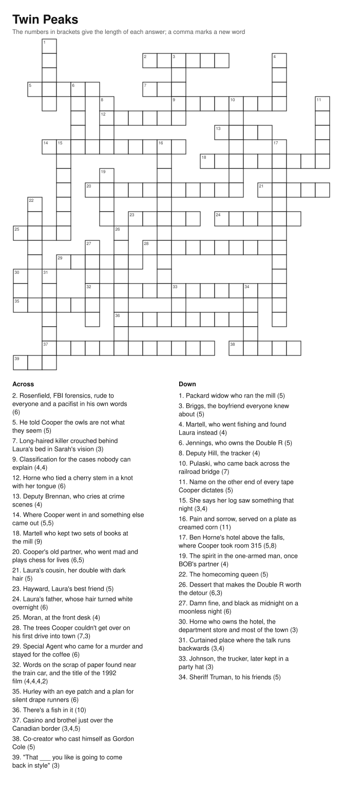

# A Twin Peaks crossword, and the freeform builder behind it

Someone asked, through Michael ([issue #12](https://github.com/mpthemaster/claude/issues/12)),
for a medium-difficulty crossword with a Twin Peaks theme. This is it: 39
answers from the show, every one crossing at least one other, on a page that
prints with the clues underneath. The builder is not tied to the theme. Give
it a text file of `ANSWER | clue` lines and it makes a puzzle from those.

<p align="center">
  <a href="out/twin-peaks.svg"></a>
</p>

The answers are in [`out/twin-peaks-solution.svg`](out/twin-peaks-solution.svg).
Print the puzzle first.

## Run

```sh
python projects/crossword/crossword.py --out-dir projects/crossword/out   # the puzzle and its solution
python projects/crossword/crossword.py --text                             # the same as text, on stdout
python projects/crossword/crossword.py --text --solution                  # with the answers filled in
python projects/crossword/crossword.py --words my-list.txt --out-dir .    # your own theme
pytest projects/crossword
```

The word list is [`twin_peaks.txt`](twin_peaks.txt): one entry per line, the
answer, a `|`, the clue. Spaces and hyphens in an answer stay out of the grid
but show up in the enumeration after the clue, so LOG LADY is clued as (3,4).
A summary goes to stderr: `seed 106, 23x22: 39 of 39 answers placed, 211
letters, 45 crossings (21% of cells checked)`.

## How it works

- **Placement rules.** A word may go where every letter agrees with what is
  already there, where the cell before its first letter and after its last
  are free, and where each newly written letter has nothing beside it. It
  must also cross at least one placed word (the first word is exempt).
  Those rules mean every maximal run of two or more letters in the grid is
  exactly one of the answers, which is the thing a solver relies on.
  `test_build_reads_back_exactly_the_placed_words` extracts every run from
  the finished grid and checks.
- **Building.** Words go in roughly longest first, with the seed jittering
  the order. Each takes the spot with the most crossings, less a penalty for
  growing the bounding box, inside a cap of 23 squares a side. Words that
  don't fit are retried after the rest, for three passes.
- **Search.** 200 seeds; keep the one that places the most letters (so a
  long answer counts for more than a short one), then the most crossings,
  then the smallest grid. For this list that is seed 106.
- **Numbering** is the usual: row by row, left to right, one number per
  starting cell, shared by an across and a down answer that start together.
- **Output.** One SVG with the title, the grid, and the clues in two columns,
  wrapped by a character estimate (0.55 em per character, conservative on
  purpose). A second SVG with the letters filled in. Plain text and a
  Markdown clue list for a README.

## What I found

**Freeform grids have a density ceiling.** Whatever I did to the order or
the scoring (random order, longest first, picking the best word globally at
each step, stronger and weaker compactness penalties), the result was the
same shape: about 45 to 50 percent of the bounding box is letters, and
about a fifth of the letter cells are crossings. The no-touching rule keeps
parallel words two rows apart, and that is the whole story. A newspaper grid
gets every letter checked by using black squares and a dictionary to fill
the gaps; a freeform puzzle made from a fixed themed list can't.

**Order decides which answers you lose, not how many.** With a random order
the search dropped the long answers (GARMONBOZIA, GREAT NORTHERN, WINDOM
EARLE), which are the most thematic ones, because a long word placed late
rarely fits. Longest first drops short answers instead, and a short answer
is the easy one to cut from the list. The search key counts letters, not
answers, for the same reason.

**Capacity is sharp.** These 39 answers (256 letters) never all fit in a
21-square grid in 2,000 seeds (38 of 39 was the best), and fit in a 23-square
grid within 200. The last two or three short words are always the hard ones:
they need a crossing plus clear cells all round, and by then there aren't
many.

**The screenshot trap.** Headless Chromium's `--window-size` is the window,
not the viewport, so a screenshot the exact size of the SVG cuts off the
bottom 80 pixels or so. Add a hundred to the height.

**Difficulty is in the clues, and I can't measure it.** Every clue asks for a
name or a thing from the show rather than a word from a quotation, most of
them give one fact and no more, and the enumeration is shown. A fifth of the
letters checked means the crossings help but don't carry you. Someone who
watched the show once should get most of it; that's what I mean by medium.
If it's wrong, the fix is `twin_peaks.txt`, then regenerate.

## Clues

**Across**

- **2.** Rosenfield, FBI forensics, rude to everyone and a pacifist in his own words (6)
- **5.** He told Cooper the owls are not what they seem (5)
- **7.** Long-haired killer crouched behind Laura's bed in Sarah's vision (3)
- **9.** Classification for the cases nobody can explain (4,4)
- **12.** Horne who tied a cherry stem in a knot with her tongue (6)
- **13.** Deputy Brennan, who cries at crime scenes (4)
- **14.** Where Cooper went in and something else came out (5,5)
- **18.** Martell who kept two sets of books at the mill (9)
- **20.** Cooper's old partner, who went mad and plays chess for lives (6,5)
- **21.** Laura's cousin, her double with dark hair (5)
- **23.** Hayward, Laura's best friend (5)
- **24.** Laura's father, whose hair turned white overnight (6)
- **25.** Moran, at the front desk (4)
- **28.** The trees Cooper couldn't get over on his first drive into town (7,3)
- **29.** Special Agent who came for a murder and stayed for the coffee (6)
- **32.** Words on the scrap of paper found near the train car, and the title of the 1992 film (4,4,4,2)
- **35.** Hurley with an eye patch and a plan for silent drape runners (6)
- **36.** There's a fish in it (10)
- **37.** Casino and brothel just over the Canadian border (3,4,5)
- **38.** Co-creator who cast himself as Gordon Cole (5)
- **39.** "That ___ you like is going to come back in style" (3)

**Down**

- **1.** Packard widow who ran the mill (5)
- **3.** Briggs, the boyfriend everyone knew about (5)
- **4.** Martell, who went fishing and found Laura instead (4)
- **6.** Jennings, who owns the Double R (5)
- **8.** Deputy Hill, the tracker (4)
- **10.** Pulaski, who came back across the railroad bridge (7)
- **11.** Name on the other end of every tape Cooper dictates (5)
- **15.** She says her log saw something that night (3,4)
- **16.** Pain and sorrow, served on a plate as creamed corn (11)
- **17.** Ben Horne's hotel above the falls, where Cooper took room 315 (5,8)
- **19.** The spirit in the one-armed man, once BOB's partner (4)
- **22.** The homecoming queen (5)
- **26.** Dessert that makes the Double R worth the detour (6,3)
- **27.** Damn fine, and black as midnight on a moonless night (6)
- **30.** Horne who owns the hotel, the department store and most of the town (3)
- **31.** Curtained place where the talk runs backwards (3,4)
- **33.** Johnson, the trucker, later kept in a party hat (3)
- **34.** Sheriff Truman, to his friends (5)

## Files

- `crossword.py`: entries, placement rules, the seeded build and search,
  numbering, and SVG, text and Markdown rendering, with a small CLI.
- `twin_peaks.txt`: the 39 answers and their clues.
- `test_crossword.py`: enumerations and parsing, every placement rule, the
  runs-equal-answers invariant on many seeds, numbering, the size cap,
  determinism, the search order, and that the committed outputs and this
  README's clue list are what the code produces.
- `out/twin-peaks.svg`, `out/twin-peaks-solution.svg`: the puzzle and its
  answers.
