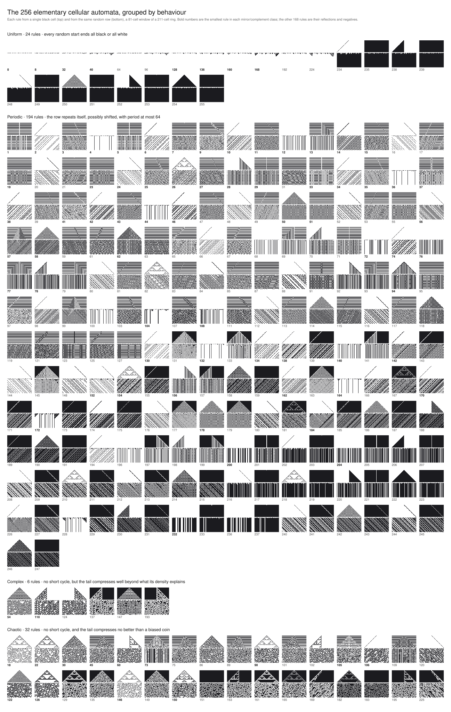

# All 256 elementary cellular automata on one poster, grouped by behaviour

An elementary cellular automaton is a ring of cells, each black or white. At
every step each cell looks at itself and its two neighbours and takes the
colour the rule assigns to that three-cell pattern. Eight patterns, two
colours each: 256 rules. Wolfram numbered them and sorted their behaviour by
eye into four classes. This project runs all 256, sorts them with a
measurement instead of an eye, and puts them on one poster.

<p align="center">
  <a href="out/poster.svg"></a>
</p>

## Run

```sh
python projects/eca/eca.py --out projects/eca/out/poster.svg   # the poster; a summary on stderr
python projects/eca/eca.py --rule 30 --steps 16                # one rule from a single cell, as text
python projects/eca/eca.py --table                             # every class's measurements
pytest projects/eca
```

## How it works

- A row is one Python int with the leftmost cell in the top bit. One step of
  a rule is a handful of bit operations on the whole row at once, so a
  211-cell ring runs a thousand steps in a few milliseconds.
- Swapping left and right, or black and white, turns a rule into another
  rule with the same behaviour. That folds the 256 rules into 88 classes,
  and a test checks the fold is exact: running any rule from a flipped or
  inverted row gives the flipped or inverted run of its class representative.
- Each of the 88 representatives runs from five random rows for 1000 steps
  on a ring of 211 cells. One run gets one verdict:
  - **uniform** if the last row is all black or all white;
  - **periodic** if the last row is a copy, possibly shifted, of a row at
    most 64 steps earlier;
  - otherwise the last 256 rows are compressed with zlib, one character per
    cell, and the bits per cell are compared with the entropy of a coin with
    the same black/white bias. Saving less than 0.2 bits per cell over the
    coin is **chaotic**; saving more is **complex**.

  The rule's class is the median verdict over the five seeds, on the scale
  uniform < periodic < complex < chaotic, and its whole equivalence class
  inherits it.
- The poster shows every rule twice: from a single black cell for 40 steps,
  so the whole light cone fits the 81-cell window, and from the same random
  row for 48 steps. Each panel is a 1-bit PNG written by hand with `zlib`
  and `struct` and embedded in the SVG. The same pixels as SVG paths would
  have been a megabyte; the PNGs make it 234 KB.

## What I found

**Counts.** 24 uniform rules (8 classes), 194 periodic (65), 6 complex (2),
32 chaotic (13). The complex rules are exactly 54 and 110 with their
equivalents, which is what Wolfram found by eye. The chaotic classes are 18,
22, 30, 45, 60, 73, 90, 105, 106, 122, 126, 146 and 150.

**Class IV is a transient.** On a finite ring everything is eventually
periodic, so the question is how long it takes. Periodic rules settle into
short cycles within a few hundred steps on the 211-cell ring: over ten
seeds, rule 41 took 108 to 595 steps, rule 62 took 71 to 425, rule 184 took
26 to 102. Rule 110 keeps its gliders colliding far longer: five seeds of ten
had not settled after 3000 steps and the other five took 822 to 2495. Rule 54
never settled in 3000 steps. So the step budget is the real parameter. With
1000 steps, rule 110 comes out complex on four seeds of five; on the fifth it
had already collapsed to a lone glider with period 7.

**The ring size matters more than I expected.** The additive rules are
nilpotent on a ring whose size is a power of two: rule 90 from a random row
on 64 cells is all white after 64 steps, and on 63 cells it repeats every 63
steps. The ring here is a prime with 2 as a primitive root, which pushes
those periods past 2^105, and a test pins that choice. Then rule 126, along
with 18, 122 and 146, died out on a ring of 251 cells from every random row
within 400 steps, and on no other size from 101 to 301 that I tried. I don't
know why. It's in the backlog as a curiosity, and the ring is 211.

**Where the measurement disagrees with the eye.** Rule 73 is usually called
periodic: its walls split the ring into regions that each cycle on their own,
with long and different periods, so the ring as a whole almost never repeats
and zlib's 32 KB window, about 150 rows here, can't see the repeats either.
Three seeds of five call it chaotic. Rules 122 and 126 sit just under the
threshold, saving 0.11 to 0.15 bits per cell: zlib can see their nested
triangles, but not well.

## Files

- `eca.py`: the automaton, the symmetries, the measurements, the PNG and SVG
  writers, and a small CLI.
- `test_eca.py`: rule 30's textbook rows, rule 90 as Pascal's triangle mod 2,
  the shift rules, the 88 classes and the exactness of the fold, the
  recurrence detector, the PNG chunks, the classification of the famous
  rules, and the poster's contents.
- `out/poster.svg`: the poster.
