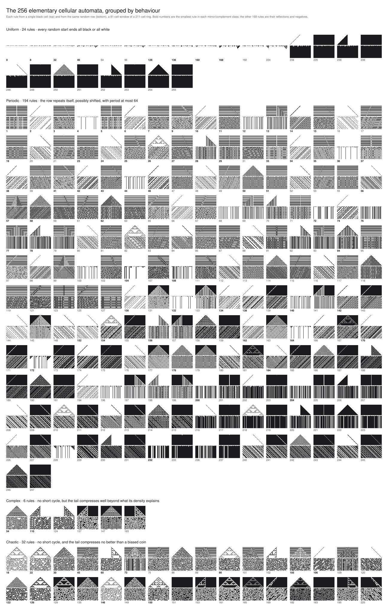
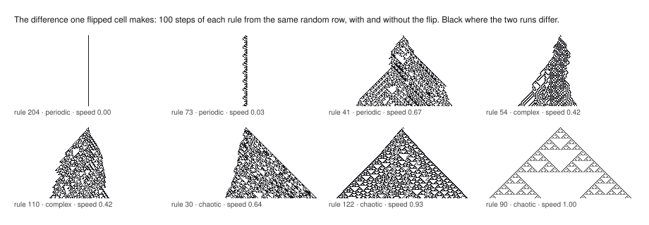

# All 256 elementary cellular automata on one poster, grouped by behaviour

An elementary cellular automaton is a ring of cells, each black or white. At
every step each cell looks at itself and its two neighbours and takes the
colour the rule assigns to that three-cell pattern. Eight patterns, two
colours each: 256 rules. Wolfram numbered them and sorted their behaviour by
eye into four classes. This project runs all 256, sorts them with a
measurement instead of an eye, and puts them on one poster.

<p align="center">
  <a href="out/poster.svg"></a>
</p>

## Run

```sh
python projects/eca/eca.py --out projects/eca/out/poster.svg   # the poster; a summary on stderr
python projects/eca/eca.py --rule 30 --steps 16                # one rule from a single cell, as text
python projects/eca/eca.py --table                             # every class's measurements
python projects/eca/eca.py --damage                            # how far one flipped cell's difference spreads
python projects/eca/eca.py --damage-out projects/eca/out/damage.svg   # eight rules' difference as a picture
pytest projects/eca
```

## How it works

- A row is one Python int with the leftmost cell in the top bit. One step of
  a rule is a handful of bit operations on the whole row at once, so a
  211-cell ring runs a thousand steps in a few milliseconds.
- Swapping left and right, or black and white, turns a rule into another
  rule with the same behaviour. That folds the 256 rules into 88 classes,
  and a test checks the fold is exact: running any rule from a flipped or
  inverted row gives the flipped or inverted run of its class representative.
- Each of the 88 representatives runs from five random rows on a ring of
  211 cells until some row comes back exactly, or for 4000 steps if none
  does. A dictionary from row to step finds the first repeat, which gives
  the settling time (steps before the cycle) and the exact period at once.
  One run gets one verdict:
  - **uniform** if it settled on an all-black or all-white row;
  - **periodic** if it settled on anything else, however long the cycle;
  - otherwise the last 256 rows are compressed with zlib, one character per
    cell, and the bits per cell are compared with the entropy of a coin with
    the same black/white bias. Saving less than 0.2 bits per cell over the
    coin is **chaotic**; saving more is **complex**.

  The rule's class is the median verdict over the five seeds, on the scale
  uniform < periodic < complex < chaotic, and its whole equivalence class
  inherits it.
- A second measure owes nothing to compression. The middle cell of a random
  row is flipped, the ring runs 100 steps with and without the flip, and
  the difference between the two runs is watched: how many cells disagree,
  and how far apart the outermost disagreements are. That width, as a
  fraction of the 201-cell light cone, is the speed; 1.0 is one cell per
  step in both directions, the most any rule can manage. A hundred steps is
  under half the ring, so the cone can't wrap round and meet itself.
  `--damage` prints every class's speeds over twenty random rows beside its
  zlib verdict; `--damage-out` draws eight rules.
- The poster shows every rule twice: from a single black cell for 40 steps,
  so the whole light cone fits the 81-cell window, and from the same random
  row for 47 steps, 48 rows. Each panel is a 1-bit PNG written by hand with `zlib`
  and `struct` and embedded in the SVG. The same pixels as SVG paths would
  have been a megabyte; the PNGs make it 234 KB.

## What I found

**Counts.** 24 uniform rules (8 classes), 196 periodic (66), 6 complex (2),
30 chaotic (12). The complex rules are exactly 54 and 110 with their
equivalents, which is what Wolfram found by eye. The chaotic classes are 18,
22, 30, 45, 60, 90, 105, 106, 122, 126, 146 and 150.

**Class IV is a transient, but so is rule 73.** On a finite ring everything
is eventually periodic, so the question is how long it takes. Over twenty
seeds, most periodic rules fell into their cycle within 600 steps (rule 41
took up to 587, rule 62 up to 423, and the next longest was 221). Rule 110
settled once in twenty runs, after 815 steps, into a cycle of 7; the other
nineteen were still going at 4000. Rule 54 settled once too, after 3415.
The chaotic rules never settled, and can't be expected to: their cycles on
this ring are astronomically long. That looks like a clean gap, but rule 73
breaks it. Its regions take up to 1299 steps to lock into step, so settling
time alone doesn't separate class IV from class II, and it can't separate
class IV from class III at all. That's still zlib's job, on the runs that
never settle, and there's no separate long-transient rule.

The first version checked for a cycle only at step 1000, only up to 64 steps
back, and counted a shifted copy as a repeat. Looking for an exact repeat
at every step is simpler and faster (the whole table takes about a second),
and there's no period limit to argue about. The price is that a pattern
drifting around the ring only counts as repeating once it has gone all the
way round, so rule 2's period is 211 rather than 1, rule 41's is 1688 =
8 x 211, and rule 26's is 3376 = 16 x 211 from about half the seeds. So the
budget is still the real parameter; it just bounds transient plus period now
instead of the period alone. In twenty seeds that sum reached 3399 for rule
26 and 3212 for rule 73, both inside 4000, and 3419 for rule 54's one
settled run. A bigger budget isn't free of judgement either: at 40,000
steps a second rule-110 seed settles, after 1604 steps, into a cycle of
7596.

**The ring size matters more than I expected.** The additive rules are
nilpotent on a ring whose size is a power of two: rule 90 from a random row
on 64 cells is all white after 32 steps, and on 63 cells it repeats every 63
steps. The ring here is a prime with 2 as a primitive root, which pushes
those periods past 2^105, and a test pins that choice. Then rule 126 died
out on a ring of 251 cells from every random row within 400 steps, and on no
other size from 101 to 301 that I tried; its relatives 18, 122 and 146 die
there too, from about half of the random rows within 3000 steps. I don't
know why. It's in the backlog as a curiosity, and the ring is 211.

**Rule 73, settled.** Rule 73 is usually called periodic: its walls split
the ring into regions that each cycle on their own, and the ring as a whole
repeats once every region does. The first version's 64-step limit cut off
its periods (72 to 360), so it fell through to zlib and came out chaotic.
Without the limit it's periodic on all five seeds: periods 120, 720, 360, 72
and 360, reached after 18 to 1299 steps. On sixteen seeds of twenty it
settles within 4000 steps. Three of the other four are periodic too, just
beyond the budget: at 40,000 steps they settle into cycles of 7920, 11520
and 27720. Within the budget their tails compress badly (0.02 to 0.18 bits
per cell saved) and are called chaotic, so the median over seeds is what
keeps this rule's verdict right.

**Where the measurement is close.** Rules 122 and 126 sit just under the
threshold, saving 0.15 to 0.16 bits per cell: zlib can see their nested
triangles, but not well. That's why there's a second measure.

**A second opinion: how far one flipped cell spreads.** The line between
complex and chaotic rests on one zlib threshold, so I measured something zlib
knows nothing about, the speed at which a rule carries the difference made
by flipping a single cell, from twenty random rows per rule.

<p align="center">
  <a href="out/damage.svg"></a>
</p>

- The rules just under the threshold are not borderline by this measure.
  Rules 122 and 126 are among the fastest spreaders there are, at median
  speeds of 0.93 and 0.94, and they carry the difference from nineteen rows
  in twenty. Rule 30, the textbook chaotic rule, is steadier and slower:
  0.55 to 0.68, never forgetting a flip. So zlib's near miss on 122 and 126
  was its trouble seeing nested triangles, not those rules being nearly
  ordered.
- The complex rules are slow and uneven. Rule 54's speeds run from 0.00 to
  0.58 with a median of 0.32, rule 110's from 0.04 to 0.56 with a median of
  0.40; whether a flip matters depends on what it hits. The figure shows
  it: under 54 and 110 the difference wanders in a narrow, ragged cone,
  under 30 it fills a steady one. The gap between the slowest chaotic
  median (rule 18 at 0.46) and the fastest complex one (0.40) is small, so
  this measure alone wouldn't classify either; it's the agreement of two
  unrelated measures on 122 and 126 that settles them.
- The additive rules 90, 150 and 105 run at exactly 1.0 from every row,
  and their difference is the rule's own single-cell pattern, because a rule
  that is XOR of its inputs acts on differences the way it acts on rows. A
  test checks that rule 90's damage is Pascal's triangle mod 2 to the last
  cell, with 2^popcount(t) disagreeing cells at step t.
- The measure has its own blind spots. Rule 41 is periodic (period 1688
  after transients of up to 587 steps) but carries a difference at a median
  0.59 in the first hundred steps, because it is still in its transient
  then. Chaotic rule 18 forgets the flip from half of its rows and spreads
  it at up to 0.97 from the others; rule 18 is known for defects that wander
  and annihilate in pairs, which would explain it, but I haven't checked
  that here.

## Files

- `eca.py`: the automaton, the symmetries, the measurements, the damage
  measure, the PNG and SVG writers, and a small CLI.
- `test_eca.py`: rule 30's textbook rows, rule 90 as Pascal's triangle mod 2,
  the shift rules, the 88 classes and the exactness of the fold, the
  settling detector, rule 73's long cycles, the damage of the identity, a
  shift, rule 0 and rule 90 (exactly its single-cell run), the speeds that
  the paragraph above claims, the PNG chunks, the classification of the
  famous rules, and the poster's and the figure's contents.
- `out/poster.svg`: the poster.
- `out/damage.svg`: the difference one flipped cell makes under eight rules.
