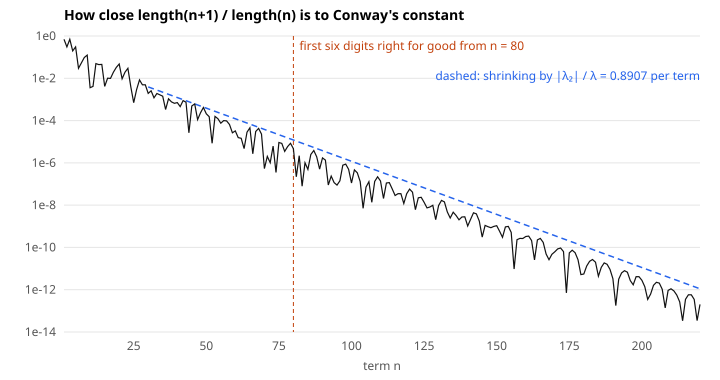
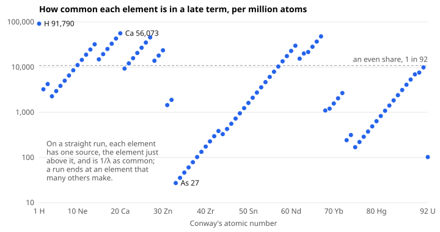

# Look-and-say: Conway's constant, from the sequence up

Start with 1 and read each term aloud to get the next: one 1 is 11, two 1s
is 21, one 2 one 1 is 1211, then 111221, 312211, and on. The lengths grow
by about 30% a term, and John Conway proved the growth factor tends to a
definite number, λ = 1.3035772690..., the only positive real root of a
polynomial of degree 71. The backlog asked how many terms it takes for the
ratio of successive lengths to get six digits of it. The answer is 80,
which is too far to reach by building the strings (term 80 has 2.5 billion
digits), so the project goes the way Conway did: it splits the terms into
"elements" that evolve independently and counts those instead. It finds
the elements from the sequence itself rather than from a table, and they
come out as Conway's 92.

A second pass puts Conway's names on them and asks how common each one is
in a late term: the long-run share of hydrogen, of uranium, and of
everything in between.

<p align="center">
  <a href="out/convergence.svg"></a>
</p>

## Run

```sh
python projects/lookandsay/lookandsay.py                                          # elements, polynomial, constant, and the digits table
python projects/lookandsay/lookandsay.py --out projects/lookandsay/out/convergence.svg  # and the chart
python projects/lookandsay/lookandsay.py --abundance-out projects/lookandsay/out/abundance.svg  # the abundance chart
pytest projects/lookandsay
```

The whole run takes about six-tenths of a second.

## How it works

- **When does a string split?** Reading `xy` aloud gives the reading of `x`
  followed by the reading of `y` exactly when the last digit of `x` differs
  from the first digit of `y`; otherwise the two runs merge. Reading aloud
  never changes a string's last digit (the last run is still read as
  "count, that digit"), so `x` and `y` stay separate forever exactly when
  the last digit of `x` never turns up as the first digit of `y`, `y` read
  once, `y` read twice, and so on.
- **The first digits, exactly.** That's an infinite condition, but it can
  be checked in finite time. Follow only a prefix of `y`'s descendants:
  reading a prefix aloud gets every run right except maybe the last, which
  may have been cut short, so dropping the final count-digit pair leaves a
  true prefix of the next string. Cut it to 16 characters and repeat. Each
  prefix is a function of the one before, so the first time one repeats,
  the sequence of leading digits is periodic from there on and the set of
  them is complete. For every suffix of every element this takes at most
  18 steps, and a cap of 8 or 32 gives the same sets, which a test checks.
- **The elements.** Split each string at every point that passes, recurse
  on the pieces, and follow what each piece becomes. From "1", 99 distinct
  pieces turn up. Seven of them are just the first seven terms, which never
  come back (1, 11, 21, 1211, 111221, 312211, 13112221). The eighth term,
  1113213211, is the first to split: into 11132 and 13211, hafnium and tin
  in Conway's naming. The other 92 each reappear among their own
  descendants, and they are exactly Conway's 92 elements, from hydrogen
  (22, which reads as itself) to uranium (3), the longest being 42 digits.
  The count, the longest, and every element breaking into elements are
  tested; so is the claim that the splits hold, by evolving a split term
  for ten steps both whole and in pieces.
- **Counting instead of building.** Each element becomes a fixed list of
  elements, so a term is a vector of 92 counts (plus the seven genesis
  strings at the start) and one step is a matrix multiplication. The counted
  lengths match real strings for the first 40 terms, and the 50th is
  894,810 digits, as it should be. A thousand terms, with exact integers of
  a hundred-plus digits, takes a fraction of a second.
- **The polynomial.** The characteristic polynomial of the 92×92 decay
  matrix is computed exactly: by Hessenberg reduction modulo large primes,
  enough of them to cover a proven bound on the coefficients (Hadamard's
  inequality on the principal minors), glued together by the Chinese
  remainder theorem. It factors as x¹⁸ (x − 1)² (x + 1) times a degree-71
  polynomial, which is Conway's shape; the degree-71 factor is his famous
  polynomial, and a test checks the whole factorization. Newton's method on that factor gives

  ```
  λ = 1.30357726903429639125709911215255189073070250465940...
  ```

  and length(1001) / length(1000) agrees with it to all 50 places. That's
  two independent routes to the same number, one through exact counting and
  one through the algebra, meeting at the fiftieth digit.

## What I found

How long the ratio length(n+1) / length(n) takes to get its first d digits
right, and keep them (cut off, not rounded, so six digits means 1.30357):

```
 digits   from term
    2        28
    3        28
    4        47
    5        70
    6        80
    7       103
    8       121
   10       178
   12       196
```

So six digits takes 80 terms, and it's a slow crawl: roughly one more
digit every 20 terms. The reason is the next-largest root of the degree-71
polynomial, a complex pair at −0.98797 ± 0.61001i, of modulus 1.16112.
The error in the ratio shrinks like (1.16112 / 1.30358)ⁿ = 0.8907ⁿ, which
is the dashed line in the chart: a factor of ten every 20 terms. Because
the second root is complex, the error doesn't just shrink but swings, and
the ratio overshoots and undershoots the constant as it closes in. That's
the jaggedness, and it is why "for good" matters: the ratio at term 44
already has four digits, briefly, and loses them again.

The six-digit mark shows it well. The ratio first has six digits right at
term 66, loses them at once, gets them back at 70, keeps them through 72,
loses them at 73, and flickers (right at 74, 77 and 78, wrong at 75, 76
and 79) before settling at 80.

## Names and abundances

<p align="center">
  <a href="out/abundance.svg"></a>
</p>

- **Which string is which element.** Conway numbered his elements from
  hydrogen (22) to uranium (3) so that each one's decay includes the
  element numbered one below it. The code looks for every ordering with
  that property, by depth-first search, and there are exactly four. They
  agree from uranium down to hafnium (72) and from calcium (20) down to
  hydrogen, and differ in between. One fact from Conway's table, that tin
  is 13211, picks out his ordering, and the test checks nine more of his
  entries against it. So the names are "found" only up to that one fact,
  plus the periodic table's symbols, which are typed in.
- **Abundances.** A term is a vector of element counts, and one step
  multiplies it by the decay matrix, so in the long run the counts line
  up with the matrix's left eigenvector for λ, its Perron vector. The code
  solves for it directly, by Gaussian elimination in 60-digit decimals,
  and separately counts the atoms in term 1,000 exactly. The two agree to
  49 significant digits for every element, as the second eigenvalue says
  they should (0.8907¹⁰⁰⁰ is about 10⁻⁵⁰). Hydrogen comes out at
  91,790.383 atoms per million and arsenic at 27.246, Conway's figures.

```
 most common        per million     least common     per million
 H  22               91,790.383      Br 3113112211322112        46.300
 Ca 12               56,072.543      Se 13211321222113222112    35.518
 Ho 1321132          47,987.529      As 1113122113121132...     27.246
```

The average atom is 7.674 digits long, so a late term of length L is
made of about L / 7.674 atoms.

## What the abundance chart shows

The dots don't scatter; they climb in straight lines. The reason is short.
In the long run, λ times an element's share is the sum of the shares of
whatever decays into it. Seventy-five of the 92 elements have exactly one
source, which makes them once, and for 74 of those the source is the
element one above in Conway's numbering. For those, λ·a(e) = a(parent):
each is exactly 1/λ as common as the element above it, a straight line of
slope log λ on a log scale. A run ends at one of the 17 elements that
several others make, and the line jumps there. Calcium (12) has thirteen
sources and hydrogen seven (one of them hydrogen itself), which is why
they're the most common. The longest run is seventeen elements, ruthenium
(44) up to neodymium (60), each 1.3036 times the last. Arsenic is the
bottom of a run of ten that starts from technetium, which has only two
sources and isn't common itself. The one exception to the rule is
uranium: its only source is yttrium, element 39, so it sits apart from
its neighbours, 96 times rarer than the protactinium it decays into.

## Notes

- The first-digit argument is the only piece of Conway's theory the code
  needs, and it is small enough to prove in a paragraph (above). His
  Cosmological Theorem, that every string eventually splits into these
  elements (plus two "transuranic" ones for each digit above 3, which
  never appear from "1"), is not reproduced yet; starting from "1" it
  isn't needed. A brute-force test of it is the next item in the backlog.
- The polynomial's roots other than λ come from the Durand-Kerner
  iteration in floating point, and the test checks each one's residual.
  The second root's modulus is quoted to five places, which is what that
  check supports. λ itself is polished separately with Newton's method in
  60-digit decimals.
- I didn't prove the degree-71 factor irreducible. It's known to be, and
  nothing here depends on it.
