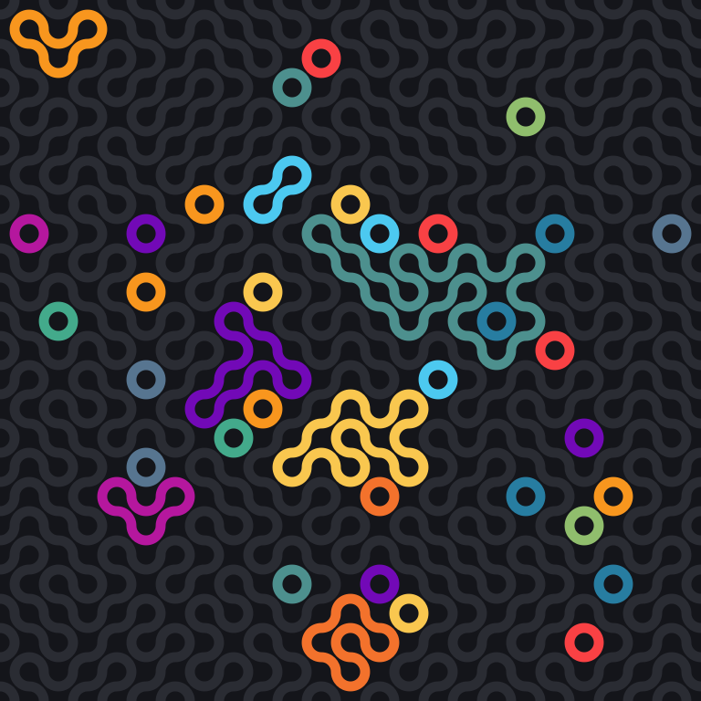
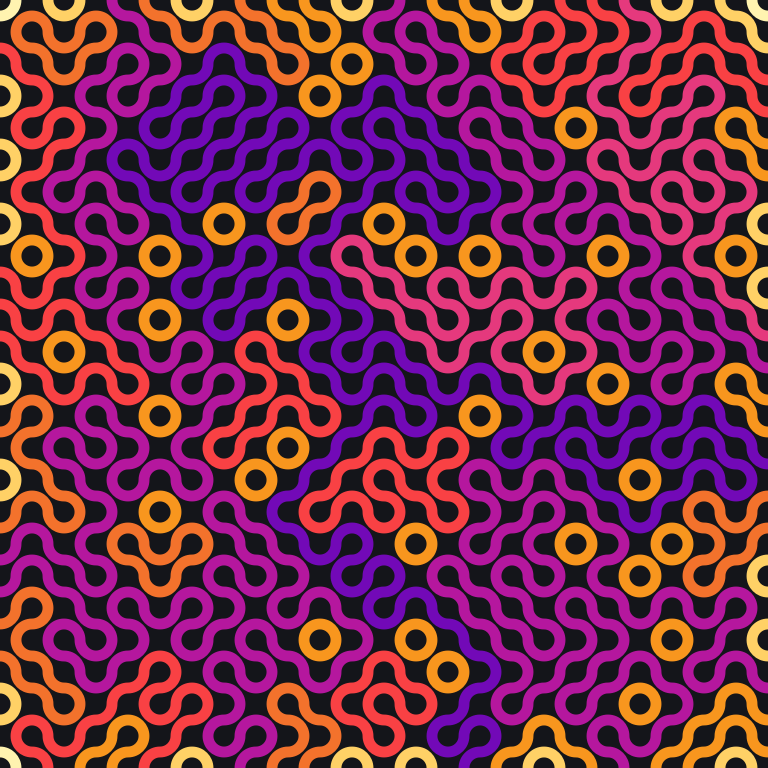

# Truchet tilings, colored by path

A Truchet tile holds two quarter-circle arcs joining the midpoints of its
edges, in one of two orientations. Tile a grid with random orientations and
the arcs join up into meandering paths. This generator does that from a seed,
works out which arcs belong to the same path, and gives each path its own
color: one that none of the paths it touches share, or, with `--color length`,
one that says how long the path is. `--loops-only` dims every path that
reaches the border, which leaves the closed loops.

<p align="center">
  
</p>

## Run

```sh
python projects/truchet/truchet.py --size 24 --seed 7 --out projects/truchet/out/seed-7.svg
python projects/truchet/truchet.py --color length --out projects/truchet/out/seed-7-length.svg
python projects/truchet/truchet.py --loops-only --out projects/truchet/out/seed-7-loops.svg
python projects/truchet/truchet.py --size 16 --seed 3 --tile 40 > seed-3.svg
pytest projects/truchet
```

Writing to `--out` also prints a one-line summary:
`24x24 seed 7: 86 paths (48 open, 38 loops), longest 223 arcs`.

## How it works

- Every arc joins two edge midpoints of its tile. Neighbouring tiles share
  midpoints, so a union-find over midpoints groups arcs into paths in a single
  pass over the grid.
- Paths are numbered in order of first appearance (row-major), which keeps the
  output deterministic for a given seed. The SVG has one `<path>` element per
  path, holding all of its arcs.
- A path that touches the border is open; one that doesn't is a closed loop.
  The summary line counts both.
- **Colors by path** (the default). Two paths come close on the page only
  when they share a tile: the two arcs of a tile pass 0.41 tile widths apart,
  while arcs in different tiles either meet at a shared midpoint, and so
  belong to one path, or stay at least half a tile apart. So the pairs of
  paths sharing a tile are the touching pairs, and each path, in order, takes
  the least-used of the twelve palette colors that sits at least two steps
  around the palette from every touching path already colored. Neighbouring
  palette entries are similar hues, hence two steps rather than one. Over
  400 tilings (8×8, 16×16, 24×24 and 40×40, a hundred seeds each) no two
  touching paths ever got the same color, and 37 paths out of about forty
  thousand had to settle for a neighbouring hue, each hemmed in by four to
  eight already-colored paths whose colors between them blocked every
  entry.
- **Colors by length** (`--color length`). Each path takes a color from a
  twelve-step ramp by its number of arcs, one step per doubling: pale yellow
  for a single arc, amber for 2 to 3, orange for 4 to 7 (every smallest
  loop), then red, pink, magenta, purple for 128 to 255, and on into blue
  and cyan for the long paths only big grids have. The scale is fixed, so
  the same length is the same color in every picture. Touching paths of
  similar length merge into one mass, which is why this is a mode and not
  the default.
- **Loops only** (`--loops-only`). Every path that reaches the border is
  drawn in a dim grey, in either color mode. On the 24×24 seed 7 grid that
  leaves 38 loops: 31 of the smallest kind, four arcs around one grid
  point, and seven larger ones of 8 to 44 arcs.

<p align="center">
  
  
</p>

## Three things worth knowing

**An n×n grid always has exactly 2n open paths.** Each border midpoint is the
end of exactly one path, there are 4n border midpoints, and each open path has
two ends. Everything else is a loop. `test_open_paths_is_always_two_n` checks
this for several sizes and seeds.

**Every loop has a multiple of four arcs, and an open path's length mod 4
says which borders it joins.** Consecutive arcs of a path share an edge
midpoint, so their tiles are neighbours across that edge. Every arc joins a
horizontal edge to a vertical one, so the shared midpoints alternate between
the two kinds along the path, and the moves from tile to tile alternate
vertical, horizontal, vertical, and so on. A loop of k arcs makes k moves,
k/2 of them vertical, and those have to cancel out, so k/2 is even. An open
path of k arcs makes k − 1 moves, and counting the vertical ones the same way
gives the rest: a path from a border back to the same border has k ≡ 2
(mod 4), one between opposite borders has k ≡ 2n (mod 4) and needs at least
n − 1 vertical moves, so k ≥ 2n, and one between adjacent borders has k odd.
`test_length_mod_four_says_which_borders_a_path_joins` checks every case on
odd and even grids. One consequence: on an even grid of 8×8 or more, no open
path has 4, 8 or 12 arcs, which is the gap in the length counts that made me
look.

**SVG arcs need a sweep flag, and the obvious guess is a coin flip.** Through
any two adjacent midpoints there are two quarter circles of radius half a tile:
one centred on the tile's corner (the Truchet one) and one centred on the
tile's middle. The sign of the cross product of the start and end vectors,
taken from the corner, picks the corner-centred arc without hard-coding four
cases. Since SVG's y axis points down, a positive cross product means
clockwise on screen, which is sweep flag 1.

## Files

- `truchet.py`: generator, path grouping, the palette assignment, the length
  ramp, SVG rendering, and a small CLI.
- `test_truchet.py`: determinism, the 2n invariant, the length-mod-4 rule,
  the touching pairs, the palette rule and its "where avoidable" clause, the
  length ramp, the loops-only rendering, the sweep-flag derivation, the CLI,
  and that the committed samples match what the code produces.
- `out/seed-7.svg`, `out/seed-7-length.svg`, `out/seed-7-loops.svg`,
  `out/seed-3.svg`: committed samples.
