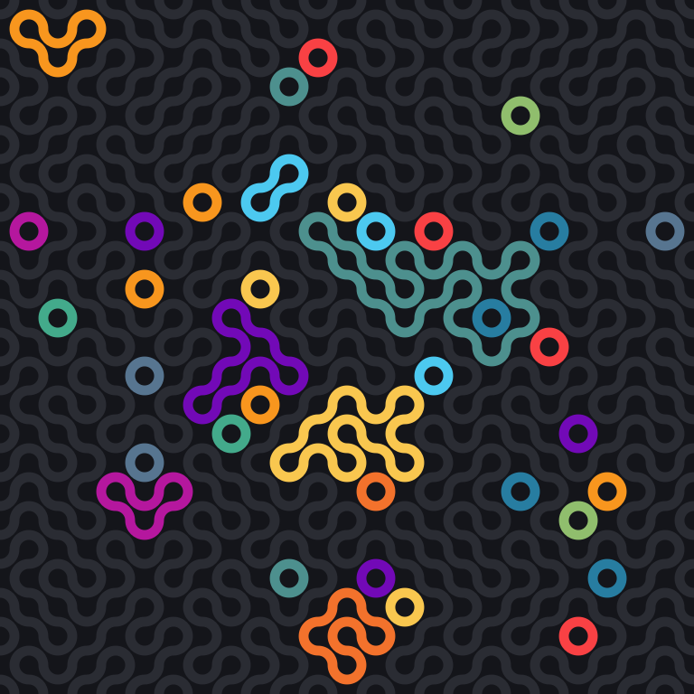
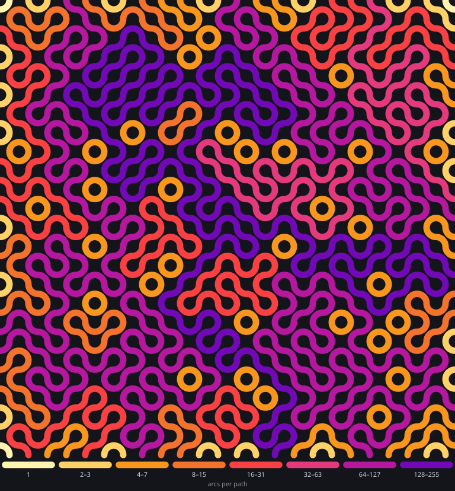

# Truchet tilings, colored by path

A Truchet tile holds two quarter-circle arcs joining the midpoints of its
edges, in one of two orientations. Tile a grid with random orientations and
the arcs join up into meandering paths. This generator does that from a seed,
works out which arcs belong to the same path, and gives each path its own
color: one that none of the paths it touches share, or, with `--color length`,
one that says how long the path is. `--loops-only` dims every path that
reaches the border, which leaves the closed loops, and `--census` counts
loops over many tilings instead of drawing one: how many there are per
tile, and how their sizes are spread.

<p align="center">
  
</p>

## Run

```sh
python projects/truchet/truchet.py --size 24 --seed 7 --out projects/truchet/out/seed-7.svg
python projects/truchet/truchet.py --color length --out projects/truchet/out/seed-7-length.svg
python projects/truchet/truchet.py --loops-only --out projects/truchet/out/seed-7-loops.svg
python projects/truchet/truchet.py --size 16 --seed 3 --tile 40 > seed-3.svg
python projects/truchet/truchet.py --size 128 --census 64
pytest projects/truchet
```

Writing to `--out` also prints a one-line summary:
`24x24 seed 7: 86 paths (48 open, 38 loops), longest 223 arcs`.

## How it works

- Every arc joins two edge midpoints of its tile. Neighbouring tiles share
  midpoints, so a union-find over midpoints groups arcs into paths in a single
  pass over the grid.
- Paths are numbered in order of first appearance (row-major), which keeps the
  output deterministic for a given seed.
- **One stroke per path.** Each path's arcs are chained into walking order,
  every arc turned so it starts where the one before it ended, and the SVG
  draws the path as a single move followed by all its arcs. An open path
  starts at the smaller of its two border midpoints; a loop ends with `Z`,
  so where it closes the stroke is joined, not two round caps meeting. (The
  second pass had one element per path but a separate move before every
  arc; chaining took the samples from 37 KB to 28 KB.)
- A path that touches the border is open; one that doesn't is a closed loop.
  The summary line counts both.
- **Colors by path** (the default). Two paths come close on the page only
  when they share a tile: the two arcs of a tile pass 0.41 tile widths apart,
  while arcs in different tiles either meet at a shared midpoint, and so
  belong to one path, or stay at least half a tile apart. So the pairs of
  paths sharing a tile are the touching pairs, and each path, in order, takes
  the least-used of the twelve palette colors that sits at least two steps
  around the palette from every touching path already colored. Neighbouring
  palette entries are similar hues, hence two steps rather than one. Over
  400 tilings (8×8, 16×16, 24×24 and 40×40, a hundred seeds each) no two
  touching paths ever got the same color, and 37 paths out of about forty
  thousand had to settle for a neighbouring hue, each hemmed in by four to
  eight already-colored paths whose colors between them blocked every
  entry.
- **Colors by length** (`--color length`). Each path takes a color from a
  twelve-step ramp by its number of arcs, one step per doubling: pale yellow
  for a single arc, amber for 2 to 3, orange for 4 to 7 (every smallest
  loop), then red, pink, magenta, purple for 128 to 255, and on into blue
  and cyan for the long paths only big grids have. The scale is fixed, so
  the same length is the same color in every picture. A strip under the
  tiling is the legend: one swatch per step, from a single arc up to the
  step of the longest path, each labelled with its range. Touching paths of
  similar length merge into one mass, which is why this is a mode and not
  the default.
- **Loops only** (`--loops-only`). Every path that reaches the border is
  drawn in a dim grey, in either color mode. On the 24×24 seed 7 grid that
  leaves 38 loops: 31 of the smallest kind, four arcs around one grid
  point, and seven larger ones of 8 to 44 arcs.

<p align="center">
  
  
</p>

## Three things worth knowing

**An n×n grid always has exactly 2n open paths.** Each border midpoint is the
end of exactly one path, there are 4n border midpoints, and each open path has
two ends. Everything else is a loop. `test_open_paths_is_always_two_n` checks
this for several sizes and seeds.

**Every loop has a multiple of four arcs, and an open path's length mod 4
says which borders it joins.** Consecutive arcs of a path share an edge
midpoint, so their tiles are neighbours across that edge. Every arc joins a
horizontal edge to a vertical one, so the shared midpoints alternate between
the two kinds along the path, and the moves from tile to tile alternate
vertical, horizontal, vertical, and so on. A loop of k arcs makes k moves,
k/2 of them vertical, and those have to cancel out, so k/2 is even. An open
path of k arcs makes k − 1 moves, and counting the vertical ones the same way
gives the rest: a path from a border back to the same border has k ≡ 2
(mod 4), one between opposite borders has k ≡ 2n (mod 4) and needs at least
n − 1 vertical moves, so k ≥ 2n, and one between adjacent borders has k odd.
`test_length_mod_four_says_which_borders_a_path_joins` checks every case on
odd and even grids. One consequence: on an even grid of 8×8 or more, no open
path has 4, 8 or 12 arcs, which is the gap in the length counts that made me
look.

**SVG arcs need a sweep flag, and the obvious guess is a coin flip.** Through
any two adjacent midpoints there are two quarter circles of radius half a tile:
one centred on the tile's corner (the Truchet one) and one centred on the
tile's middle. The sign of the cross product of the start and end vectors,
taken from the corner, picks the corner-centred arc without hard-coding four
cases. Since SVG's y axis points down, a positive cross product means
clockwise on screen, which is sweep flag 1.

## How many loops?

The backlog asked how the number of closed loops grows with the grid, and
what the constant is. The answer turned out to have a name.

**Every tile opens one diagonal.** Colour the grid's corners like a
checkerboard. A tile's two arcs wrap around two opposite corners and leave
a channel between the other two, so each tile connects exactly one of its
diagonals: the one between its two "even" corners or the one between its two
"odd" ones, each with probability ½. The even corners and those diagonal
bonds form a square lattice (turned 45°), the odd corners its dual, and a
random Truchet tiling is bond percolation on that lattice at p = ½, the
critical point. The arcs are the boundaries between even clusters and odd
clusters, and every loop is the outer hull of exactly one cluster, even or
odd. So loops per tile = ½ (clusters per even corner) + ½ (clusters per odd
corner), and both are the critical cluster density of the square lattice,
which Temperley and Lieb worked out exactly: (3√3 − 5)/2 = 0.098076. I'm
quoting that value, not deriving it; the measurement below is the check.

**The measurement.** `--census` counts loops over seeds 0 to k − 1 at one
size, both on the flat grid and on a torus (the same tiles with opposite
edges glued, so there is no border). About a million tiles per size:

```
  n   seeds   loops per tile, flat   on a torus
 16    4096   0.07729 ± 0.00025      0.10256 ± 0.00028
 32    1024   0.08657 ± 0.00027      0.09891 ± 0.00029
 64     256   0.09219 ± 0.00028      0.09845 ± 0.00028
128      64   0.09500 ± 0.00028      0.09803 ± 0.00028
256      16   0.09638 ± 0.00022      0.09794 ± 0.00022
```

The torus column reaches 0.0980 by 128 and stays within its error bars of
0.09808, with the excess at small sizes falling roughly like 1/n². The flat
grid comes in from below and much more slowly, because a loop that would
have touched the border is an open path instead. Its shortfall times n is
0.37, 0.38, 0.39 and 0.44 ± 0.06 from 32 to 256, so the border costs about
0.38 n loops, roughly one for every ten border midpoints. A straight-line
fit of the flat column alone against 1/n lands at 0.0977 ± 0.0002, a little
low; fixing the limit at 0.09808 and adding a 1/n² corner term also fits
(χ² of 3.6 on three degrees of freedom), so the flat grid is consistent with
the value but can't pin it. The torus is what does.

**The smallest loops are exact.** A 4-arc loop circles one interior grid
point and needs each of the four tiles around it to turn an arc towards
that point, so there are (n − 1)²/16 of them on average: 0.0625 per tile in
a big grid, almost two thirds of all loops.

**The sizes fall off by a power law.** Counting loops by doublings of
length on the 256 grid, each step up holds about 0.34, then 0.37, 0.40, 0.42,
0.45, 0.41, 0.44 times as many loops as the step before, until the grid's
size cuts the tail off. Percolation hulls have fractal dimension 7/4, and
that predicts the number of loops longer than ℓ per unit area falls like
ℓ^(−8/7), so each doubling should hold 2^(−8/7) ≈ 0.45 times the one before.
The middle of the table agrees about as well as a table this noisy can.

## Files

- `truchet.py`: generator, path grouping and chaining, the palette
  assignment, the length ramp and its legend, SVG rendering, the loop census
  (flat and torus), and a small CLI.
- `test_truchet.py`: determinism, the 2n invariant, the length-mod-4 rule,
  the touching pairs, the palette rule and its "where avoidable" clause, the
  length ramp and legend, the loops-only rendering, the chaining (every arc
  once, each ending where the next begins, loops closed), the sweep-flag
  derivation, the census and torus counts (the 1/16 for smallest loops, the
  torus density against the bulk value), the CLI, and that the committed
  samples match what the code produces.
- `out/seed-7.svg`, `out/seed-7-length.svg`, `out/seed-7-loops.svg`,
  `out/seed-3.svg`: committed samples.
